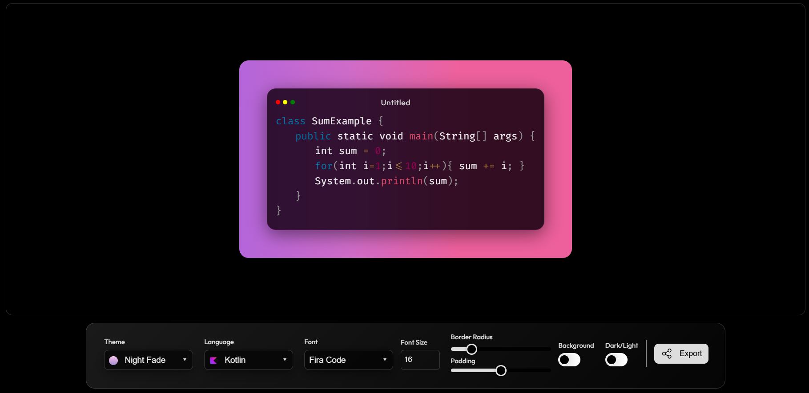

# <a href="https://snippetkit.netlify.app" target="_blank">SnippetKit - Edit & Download Your's Code Snippets</a>

SnippetKit is a lightweight web tool for producing polished code screenshots and shareable code templates. Paste or type code into the editor, pick a language for Prism.js syntax highlighting, choose fonts and themes, and fine-tune padding, border radius, and font size to match your brand or post style. Preview updates live and export high-quality PNG or SVG files, or copy images/links directly to the clipboard (secure contexts). SnippetKit also supports autoloading language components, dynamic Google Font loading, and accessible keyboard controls for the UI. Ideal for documentation, blog illustrations, social media posts, and tutorial screenshots — minimal, customizable, and easy to integrate into your workflow.

  
  
  
  

 

:star: Star me on GitHub — it helps!

# ✨ Features

✔️ Live Preview: instant syntax render  
✔️ Syntax Highlighting: Prism.js autoload  
✔️ Theme Selection: gradients & presets  
✔️ Font Selection: Google Fonts load  
✔️ Export PNG/SVG: high-quality images  
✔️ Copy to Clipboard: image & link  
✔️ Adjustable Layout: padding & radius  
✔️ Font Size Control: numeric input  
✔️ Custom Selects: keyboard accessible  
✔️ Scroll Sync: editor ↔ preview  
✔️ JSON-driven Data: themes / fonts / langs  
✔️ Accessible UI: ARIA + keyboard nav

## Installation

- [<b>GitHub</b>](https://github.com/byllzz/snippetkit) - Clone the repository to get the project files.
- [<b>VSCode / Any Code Editor</b>](https://code.visualstudio.com/) - To open and edit the code.
- [<b>Live Server</b>](https://marketplace.visualstudio.com/items?itemName=ritwickdey.LiveServer) - Optional, to view your changes live in the browser.
- [<b>Browser</b>](https://www.google.com/chrome/) - Open <code>index.html</code> to run the app.

## Usage

- Open the app in your browser.
- Paste or type code into the editor textarea.
- Choose a language from **Language** to apply Prism highlighting.
- Pick a theme from **Theme** to change background/gradient.
- Select a font from **Font** to load Google Fonts dynamically.
- Use **Font Size**, **Padding**, and **Border Radius** to style output.
- Toggle **Background** and **Dark/Light** for different looks.
- Click **Export** to open export options (PNG, SVG, Copy image/link).
- Double-click the main export button to copy current code text.
- Keyboard: use Arrow keys + Enter in custom selects; Escape closes menus.
- Note: clipboard image write requires HTTPS and browser support.

## Tech Stack ⚡

- [<b>HTML5</b>](https://developer.mozilla.org/en-US/docs/Web/HTML) - Structure of the web app.
- [<b>CSS3</b>](https://developer.mozilla.org/en-US/docs/Web/CSS) - Styling, themes, and responsive layout.
- [<b>JavaScript (ES6+)</b>](https://developer.mozilla.org/en-US/docs/Web/JavaScript) - App logic, DOM manipulation, and interactivity.
- [<b>Prism.js</b>](https://prismjs.com/) - Syntax highlighting & autoloader.
- [<b>dom-to-image-more</b>](https://www.npmjs.com/package/dom-to-image-more) - Export DOM to PNG / SVG.
- [<b>Devicons (jsDelivr)</b>](https://cdn.jsdelivr.net/gh/devicons/devicon) - Language and tech icons.
- [<b>Google Fonts</b>](https://fonts.google.com/) - Customizable fonts for code snippets.
- [<b>Vite</b>](https://vitejs.dev/) - Dev server and build tool.
- [<b>npm</b>](https://www.npmjs.com/) - Dependency and script management.
- [<b>Netlify</b>](https://www.netlify.com/) - Hosting the static site online.

# License 📄

This project is licensed under the MIT License - see the [LICENSE.md](./LICENSE) file for details.

Please contact me at bilalmalikcodes@gmail.com if you have any feedback or suggestions. :star: Star it, if you like it!
